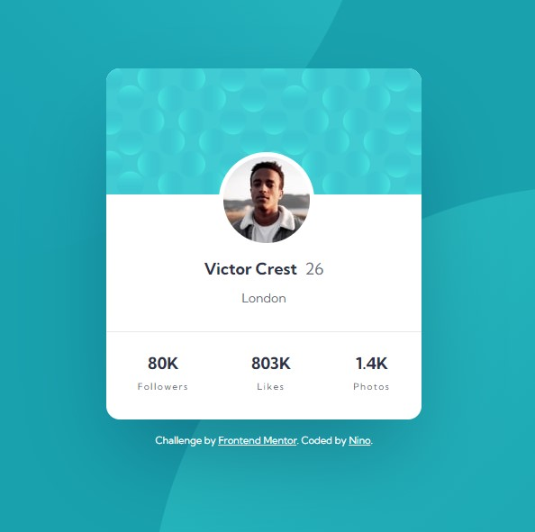

# Frontend Mentor - Profile card component solution

This is a solution to the [Profile card component challenge on Frontend Mentor](https://www.frontendmentor.io/challenges/profile-card-component-cfArpWshJ). Frontend Mentor challenges help you improve your coding skills by building realistic projects. 

## Table of contents

- [Overview](#overview)
  - [The challenge](#the-challenge)
  - [Screenshot](#screenshot)
  - [Links](#links)
- [My process](#my-process)
  - [Built with](#built-with)
  - [What I learned](#what-i-learned)
  - [Continued development](#continued-development)
  - [Useful resources](#useful-resources)
- [Author](#author)

## Overview

### The challenge

- Build out the project to the designs provided

### Screenshot

### Links

- Solution URL: [GitHub Repository](https://github.com/ninogogol/Profile-card-component-solution)
- Live Site URL: [GitHub Page](https://ninogogol.github.io/Profile-card-component-solution/)

## My process

### Built with

- Semantic HTML5 markup
- CSS custom properties
- Flexbox
- Mobile-first workflow

### What I learned

I learnd how to position background images

### Continued development

I want to build more projects to improve my coding skills.

### Useful resources

- [w3schools](https://www.w3schools.com/css/css3_backgrounds.asp) - This helped me to position background images correctly.

## Author

- Linkedin - [Nino Gogoladze](https://www.linkedin.com/in/nino-gogoladze-80a075227/)

